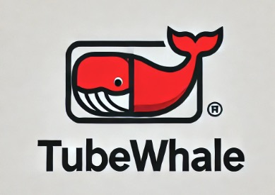
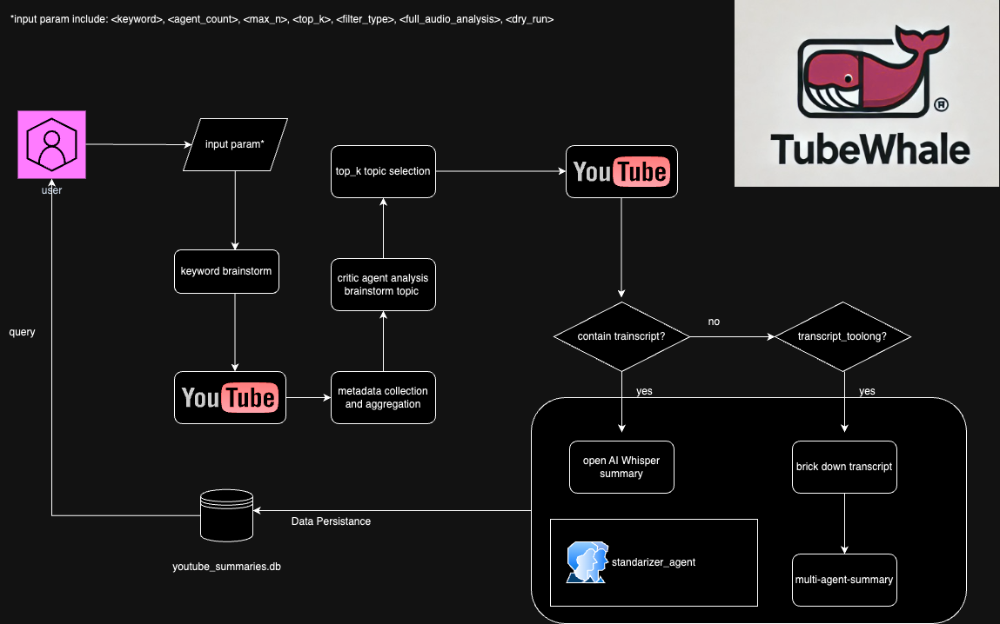

# TubeWhale

### TubeWhale – An Enhanced AI Product Documentation for Multi-Agent Keyword Brainstorming and Video Analysis

## 1. Introduction:
TubeWhale is an open-source AI-powered multi-agent video processing system designed to search for and analyze YouTube videos efficiently. By leveraging keyword brainstorming, video metadata collection, and multimodal analysis (including audio transcription), the system provides intelligent summaries and insights into video content. It is especially suited for research and use cases where automatic topic generation and summarization are essential.

Key Differentiator: The system uses multiple agents to brainstorm topic keywords and searches for YouTube videos based on those keywords. The number of videos analyzed is controlled by the user, ensuring precision and flexibility.


### Flow Chart


The focus of TubeWhale is to provide users with the ability to:
1. **Brainstorming Keywords**: Multiple AI agents brainstorm topic ideas based on an initial keyword.
2. **YouTube Video AI Search**: The system retrieves the top `k` YouTube videos for each keyword variation.
3. **Leverage multimodal capabilities** by analyzing both video metadata and audio content.
4. **Metadata Storage**: The results are saved in a database for further analysis.
5. **Transparent Research and Record Keeping**: The agent interaction process is recorded transparently for research and analysis.

Example keyword: **"Virginia fishing"** – this example will be used throughout the documentation to showcase the functionality.

## 1. Key Concepts and Parameters
When running the system, the user can customize various parameters that control how the pipeline operates:

```bash
python3 main.py --keyword="virginia fishing" --agent_count=5 --max_n=10 --top_k=5 --filter_type="relevance" --full_audio_analysis=true --dry_run=false
```

## Parameter Explanations:
--keyword: (Required)
The base search keyword input by the user. The system uses this keyword as a starting point for brainstorming variations.
Example: "virginia fishing".

--agent_count: (Required)
Defines the number of agents that will actively brainstorm keyword variations. Each agent can generate multiple keyword ideas based on different strategies.
Relation to max_n: agent_count should always be less than or equal to max_n, as each agent will brainstorm a subset of the total topics.
Example: If agent_count=5, the system will select 5 agents to generate keyword variations.

--max_n: (Required)
This is the total number of keyword topics brainstormed across all agents combined. It controls the size of the keyword pool from which the system selects the best topics.
Relation to agent_count: The system will distribute the generation of these max_n keywords among agent_count agents. Each agent is responsible for brainstorming a portion of these topics.
Example: max_n=10 means the system will generate 10 keyword topics across all agents.

--top_k: (Required)
Specifies the number of YouTube videos to retrieve and analyze for each selected keyword topic. These are the top k videos based on criteria like relevance or views.
Example: With top_k=5, the system will analyze the top 5 videos for each brainstormed keyword.

--filter_type: (Optional, Default="relevance")
Controls the filtering method applied to the YouTube search results before they are passed for further analysis.
Values: "relevance", "views", "likes", etc.
Example: If filter_type="relevance", the top-k videos are selected based on YouTube's relevance algorithm.

--full_audio_analysis: (Optional, Default=false)
This flag controls whether the system will automatically use audio transcription if no transcript is available for a video.
true: The system will attempt to transcribe the video's audio using Whisper if no transcript is found.
false: Only transcripts will be used, and if a transcript is missing, the video will be skipped.
Example: full_audio_analysis=true ensures that audio transcription is used if no transcript exists.

--dry_run: (Optional, Default=false)
This flag controls whether the system will actually make API calls or just simulate the process.
true: The system runs without contacting external APIs (YouTube, OpenAI). This is useful for testing configurations without incurring costs or API limits.
false: The system makes full API calls and persists data.
Example: dry_run=true means the system will simulate the pipeline but won't interact with APIs or store data.

--persist_agent_summaries: (Optional, Default=true)
This flag controls whether the system should store both transcript-based summaries and agent-based summaries (e.g., audio-based summaries).
true: The system will persist all generated summaries (both transcript and agent-based).
false: Only transcript-based summaries will be persisted.
Example: With persist_agent_summaries=false, only transcript-based summaries will be stored.


## 2. Environment Setup
Requirements
Python Version >=3.11.x
```bash
python3.11 -m venv venv
source venv/bin/activate
pip install pip --upgrade
pip install -r requirements.txt
python3 main.py
```
brew install ffmpeg  # or apt install ffmpeg for Linux  <todo:unsure if needed yet>
 
Make sure to set up the `.env` file with your YouTube and OpenAI API keys:
```bash
YOUTUBE_API_KEY=<your-youtube-api-key>
OPENAI_API_KEY=<your-openai-api-key>
```

 Usage Example
To run the system with your desired parameters:
```bash
python3 main.py --keyword="virginia fishing" --agent_count=5 --max_n=10 --top_k=5 --filter_type="relevance" --full_audio_analysis=true --dry_run=false
```

Example Breakdown:
--keyword="virginia fishing": The search keyword provided by the user.
--agent_count=5: Five agents will brainstorm topic variations.
--max_n=10: A total of 10 keyword variations will be brainstormed.
--top_k=5: For each brainstormed keyword, the top 5 YouTube videos will be analyzed.
--filter_type="relevance": YouTube search results will be filtered by relevance.
--full_audio_analysis=true: The system will attempt to transcribe audio if no transcript is available.
--dry_run=false: The system will fully execute and persist the results, including API interactions.

## 4. Additional Features
Brainstorming Agent: Agents collaborate to brainstorm keyword variations based on the initial keyword.
YouTube Metadata Analysis: The system retrieves video metadata, including views, likes, and comments.
Audio Transcription: When no transcript is available, the system transcribes the video's audio using Whisper.
Customizable Pipeline: Each parameter is configurable, allowing users to fine-tune the system based on their research or use case needs.

## 5. Database Schema
The database schema includes several tables:
- videos: Stores metadata and analysis results for each video.
- comments: Stores comments related to the videos.
- brainstormed_topics: Stores all brainstormed keywords and their respective critiques.
- keyword_analysis: Stores keyword analysis results after evaluating video metrics.


## 6. Contributing
We welcome contributions from the open-source community. Here’s how you can contribute:

Reporting Bugs:
If you encounter any issues while using TubeWhale, please open an issue on GitHub with a clear description of the bug and steps to reproduce it.

Pull Requests:
Fork the repository.
Create a new branch for your feature or bugfix.
Commit your changes with clear and descriptive messages.
Push your branch to your forked repository.
Open a pull request describing the changes made.
Please ensure all code passes existing tests and includes new tests as necessary.