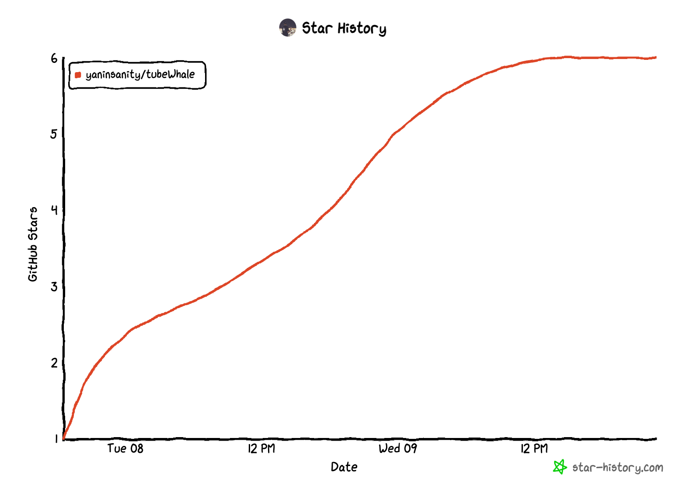

# TubeWhale 

### Project Status: 🟢

Currently the pipeline is runable, however there is still a handful of engineering works to be addressed to ensure the robustness of the pipeline.




### TubeWhale – An Enhanced AI Product Documentation for Multi-Agent Keyword Brainstorming and Video Analysis

## 1. Introduction:
TubeWhale is an open-source AI-powered multi-agent video processing system designed to search for and analyze YouTube videos efficiently. By leveraging keyword brainstorming, video metadata collection, and multimodal analysis (including audio transcription), the system provides intelligent summaries and insights into video content. It is especially suited for research and use cases where automatic topic generation and summarization are essential.

Key Differentiator: TubeWhale employs multiple AI agents to brainstorm topic keywords and searches for YouTube videos based on those keywords. Users have control over the number of videos analyzed, ensuring precision and flexibility tailored to their specific needs.

### Flow Chart


The focus of TubeWhale is to provide users with the ability to:
1. **Brainstorming Keywords**: Multiple AI agents brainstorm topic ideas based on an initial keyword.
2. **YouTube Video AI Search**: The system retrieves the top `k` YouTube videos for each keyword variation.
3. **Leverage multimodal capabilities** by analyzing both video metadata and audio content.
4. **Metadata Storage**: The results are saved in a database for further analysis.
5. **Transparent Research and Record Keeping**: The agent interaction process is recorded transparently for research and analysis.

Example keyword: **"Virginia fishing"** – this example will be used throughout the documentation to showcase the functionality.

## 1. Key Concepts and Parameters
When running the system, the user can customize various parameters that control how the pipeline operates:

```bash
python3 main.py 
```

You will receive a database with max top_K * max_n videos. This videos list will be deduplicated.

## Key Concepts and Configuration & Parameter Explanations:

### TubeWhale is highly configurable through environment variables. Below are the key parameters and their explanations to help you tailor the system to your requirements.

Environment Variable Configuration
Create a .env file in the project root directory and populate it with the necessary configurations:
```bash
# .env file
YOUTUBE_API_KEY=<your-api-key>
OPENAI_API_KEY=<your-api-key>
FULL_AUDIO_ANALYSIS=true
KEYWORD='Arizona Fishing'
PERSIST_AGENT_SUMMARIES=true
DRY_RUN=false
MAX_N=10
TOP_K=5
FILTER_TYPE="view_count"
DB_PATH="youtube_summaries.db"

```

## System Env Breakdown:

Parameter Explanations

### KEYWORD (Required)
Description:
The base search keyword input by the user. TubeWhale uses this keyword as a starting point to generate keyword variations.
Example:
KEYWORD='Arizona Fishing'

### MAX_N (Required)
Description:
The total number of keyword variations to generate.
Example:
MAX_N=10 means TubeWhale will generate 10 keyword variations.

### TOP_K (Required)
Description:
Specifies the number of YouTube videos to retrieve and analyze for each selected keyword topic.
Example:
TOP_K=5 means the system will analyze the top 5 videos for each brainstormed keyword.

### FILTER_TYPE (Optional, Default="relevance") --❌ only support views for now [🙋need to fix]
Description:
Controls the filtering method applied to the YouTube search results before they are passed for further analysis.
Values:
"relevance", "views", "likes", etc.
Example:
FILTER_TYPE="relevance" selects videos based on YouTube's relevance algorithm.

### FULL_AUDIO_ANALYSIS (Optional, Default=true)
Description:
Determines whether the system will attempt to transcribe the video's audio using Whisper if no transcript is available.
Values:
true, false
Example:
FULL_AUDIO_ANALYSIS=true ensures that audio transcription is used if no transcript exists.

### DRY_RUN (Optional, Default=false)
Description:
Controls whether the system will actually make API calls or just simulate the process.
Values:
true, false
Example:
DRY_RUN=true simulates the pipeline without interacting with APIs or storing data.

### PERSIST_AGENT_SUMMARIES (Optional, Default=true)
Description:
Determines whether the system should store both transcript-based summaries and agent-based summaries (e.g., audio-based summaries).
Values:
true, false
Example:
PERSIST_AGENT_SUMMARIES=false stores only transcript-based summaries.

### DB_PATH (Optional, Default="youtube_summaries.db")

Description:
The path to the SQLite database file where data will be stored.
Example:
DB_PATH="youtube_summaries.db"


## 2. Environment Setup
Requirements
Python Version >=3.11.x
```bash
git clone https://github.com/yaninsanity/TubeWhale.git
cd TubeWhale
python3.11 -m venv venv
source venv/bin/activate
pip install pip --upgrade
pip install -r requirements.txt
python3 main.py
```
brew install ffmpeg  
# sudo apt install ffmpeg      --  for Linux user
 
Make sure to set up the `.env` file with your YouTube and OpenAI API keys and System Param:
```bash
YOUTUBE_API_KEY=<your-youtube-api-key>
OPENAI_API_KEY=<your-openai-api-key>
TOP_K=<how-many-videos-under-under-the-keyword-list>
MAX_N=<how-many-topic-variations-you-want-system-helps-to-brainstorm>
```

# Usage Example
To run the system with your desired parameters:
```bash
python3 main.py 
```


## 4. Additional Features
Brainstorming Agent: Agents collaborate to brainstorm keyword variations based on the initial keyword.
YouTube Metadata Analysis: The system retrieves video metadata, including views, likes, and comments.
Audio Transcription: When no transcript is available, the system transcribes the video's audio using Whisper.
Customizable Pipeline: Each parameter is configurable, allowing users to fine-tune the system based on their research or use case needs.

## 5. Database Schema
The database schema includes several tables:
- videos: Stores metadata and analysis results for each video.
- comments: Stores comments related to the videos.
- brainstormed_topics: Stores all brainstormed keywords and their respective critiques.
- keyword_analysis: Stores keyword analysis results after evaluating video metrics.


## 6. Contributing
We welcome contributions from the open-source community. Here’s how you can contribute:

### Reporting Bugs[🪲]:
If you encounter any issues while using TubeWhale, please open an issue on GitHub with following:
- a clear description of the bug and steps to reproduce it.
- The way you think which module goes wrong. Any traceback?

### Pull Requests:
Fork the repository and create a new branch for your feature [🚩] or bugfix [🪲🔫] .

Commit your changes with clear and descriptive messages.
Push your branch to your forked repository.
Open a pull request describing the changes made. I will review when if I have the time 👀

## 7. Donation Polygon

###  😊 I will apprecatie if you show your love or just buy me a cup of coffee ☕️.  


# 8. License
This project is licensed under the [MIT](https://mit-license.org/) License.

# 9. Contact
For any inquiries or support, please contact: admin@jl-blog.com
with following header format: [TubeWhale]「Support/Question」______

# 10. Citing TubeWhale

If you use TubeWhale in your research or data collection, please consider citing our project to acknowledge our efforts. Proper citation helps support the continued development and maintenance of open-source tools.

